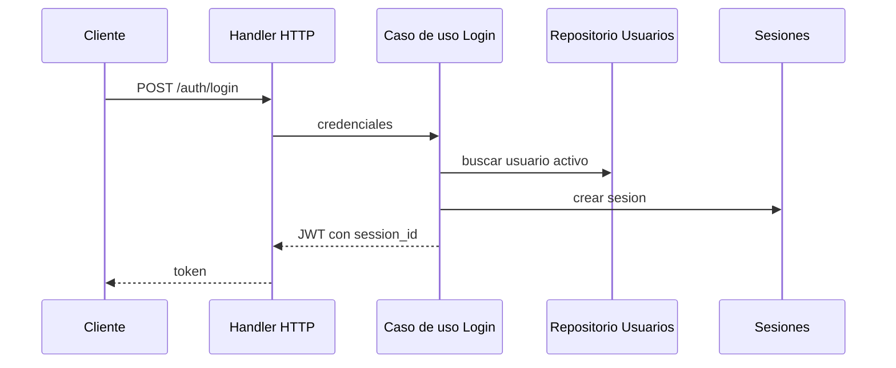
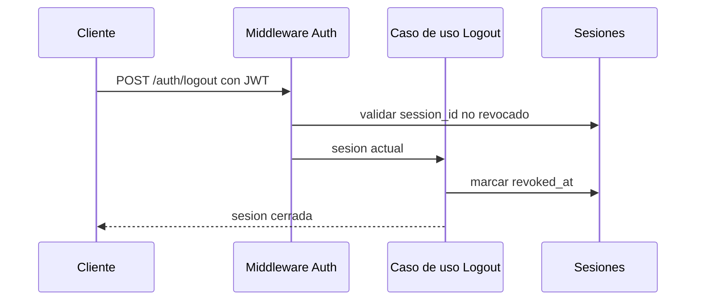
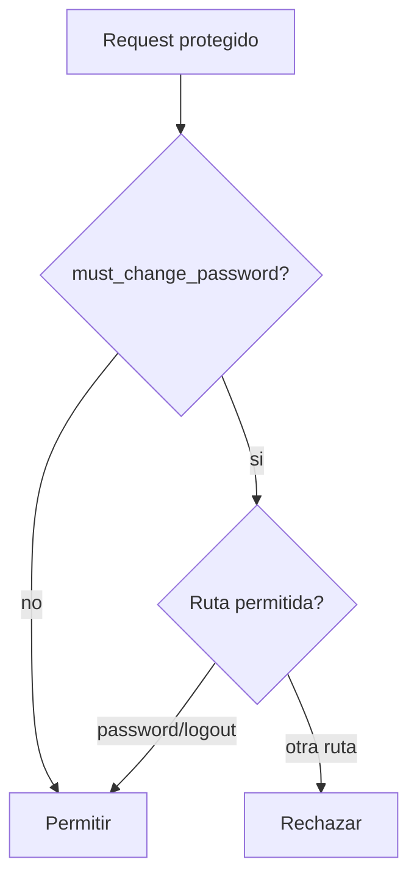
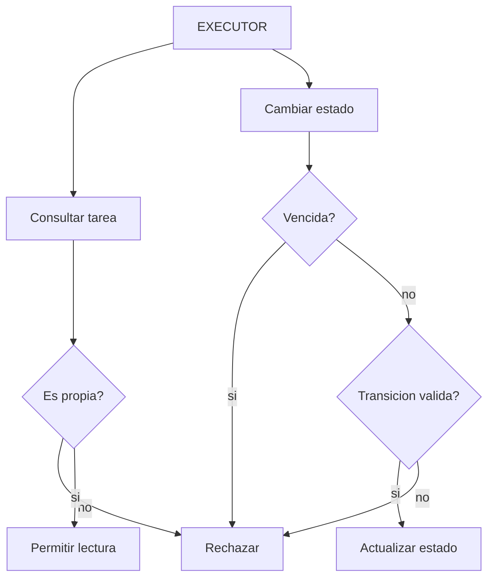
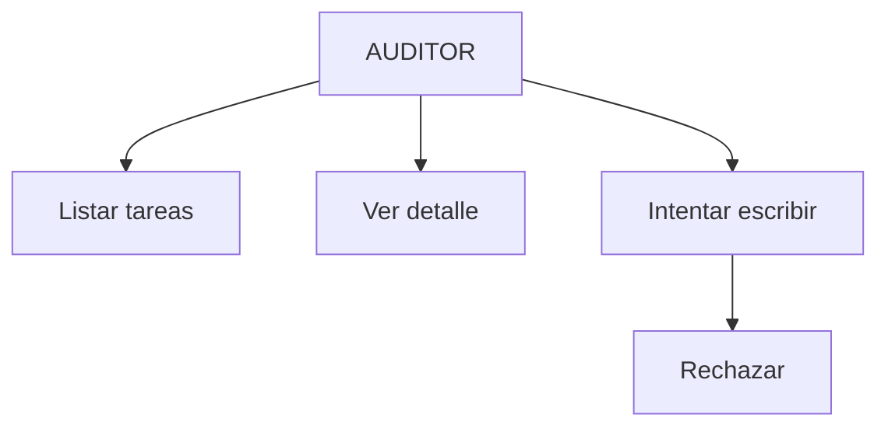
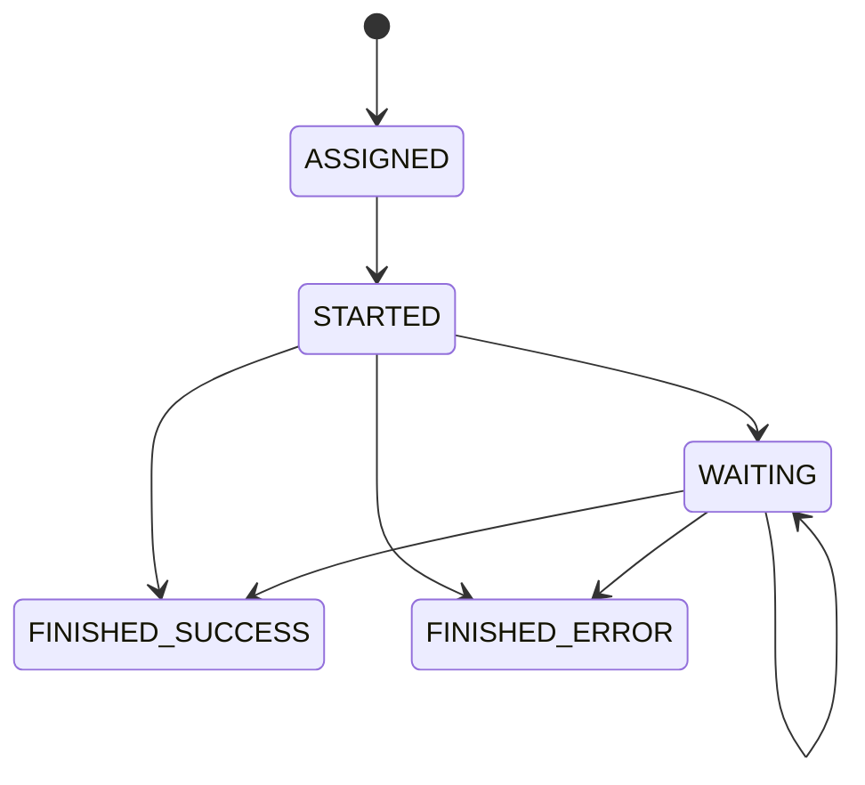

# Flujo de datos

## Estado

`PLANIFICADO`

## DISEÑO OBJETIVO — Login

## DISEÑO OBJETIVO — Logout

## DISEÑO OBJETIVO — Cambio obligatorio de contrasena

## DISEÑO OBJETIVO — Tareas por administrador

```mermaid
flowchart TD
    A[ADMIN] --> B[Crear tarea]
    B --> C{Assignee es EXECUTOR?}
    C -- no --> R[Rechazar]
    C -- si --> D[Guardar ASSIGNED]
    A --> E[Actualizar o eliminar]
    E --> F{Estado ASSIGNED?}
    F -- no --> R
    F -- si --> G[Aplicar cambio]
```

## DISEÑO OBJETIVO — Tareas por ejecutor

## DISEÑO OBJETIVO — Auditor

## DISEÑO OBJETIVO — Estados de tarea

