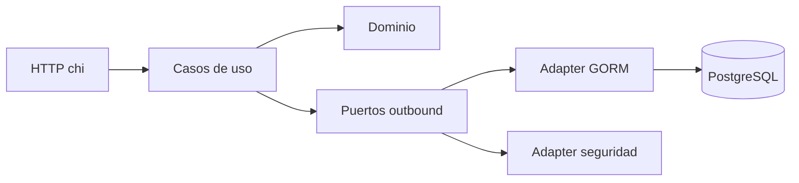

# Vision general de arquitectura

## Estado

`PLANIFICADO`

La arquitectura objetivo es hexagonal minimalista para mantener dominio y aplicacion desacoplados de frameworks, HTTP y persistencia.

## Capas objetivo

- Dominio: entidades, reglas, roles, estados, transiciones y errores de negocio.
- Aplicacion: casos de uso, puertos internos y coordinacion de reglas.
- Adapters inbound: handlers HTTP con `chi`.
- Adapters outbound: persistencia PostgreSQL con GORM, hashing bcrypt y emision/validacion JWT.

## DISEÑO OBJETIVO — Arquitectura hexagonal

## Persistencia objetivo

- PostgreSQL como base de datos.
- GORM como ORM.
- `AutoMigrate` para inicializacion de esquema.
- Modelos GORM separados de modelos de dominio.
- GORM solo en adapters outbound.

## Seguridad objetivo

- JWT con `session_id`.
- Sesiones persistidas y revocables.
- Logout mediante revocacion de sesion.
- bcrypt para hash de contrasenas.
